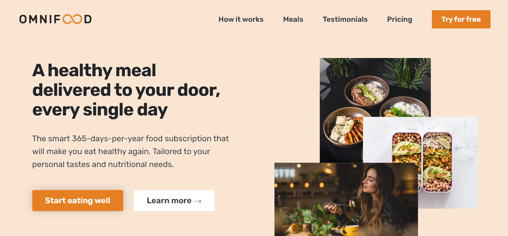
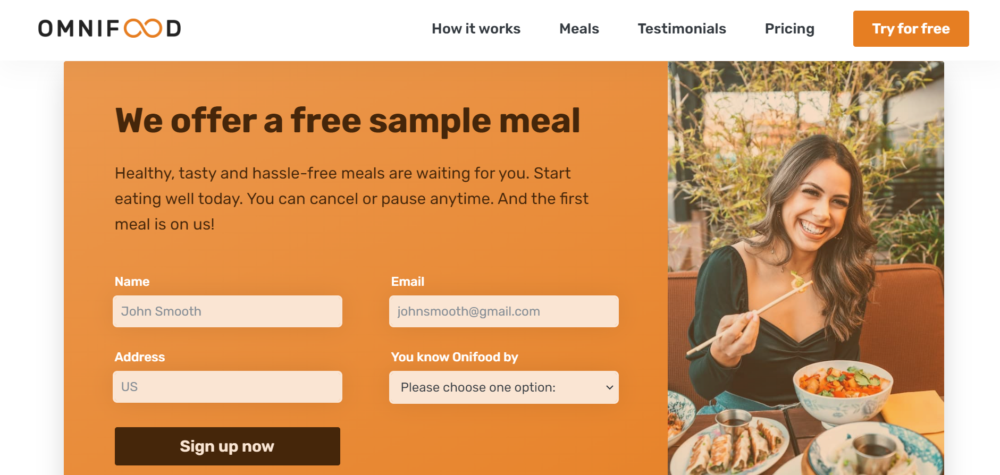

# ONIFOOD PROJECT

## Introduce

This [website](https://html-css-final-project-lh.netlify.app/) is one landing page build by use _html, css, web design,_ cover some section necessary on a page like _hero, call to action, testimonials, header, footer...._

**Hero section**

**Call to action section**

## Write by use HTML, HTML5, CSS, CSS3

**HTML**: use [HTML5](https://vi.wikipedia.org/wiki/HTML5) to build the sematic structure with sematic elements, layouts
**CSS**: use [CSS3](https://www.tutorialspoint.com/css/css3_tutorial.htm#:~:text=Cascading%20Style%20Sheets%20%28CSS%29%20is,Namespaces) for styling

- Use Grid, Flex to build layouts
- Animations: transition, filter....
- Shadow: box-shadow
- Link and hyper link
- Reset styling
- Build responsive with media query for screens with size range 100-200

**Web design**: typos, images, hierarchy, content, web types....
**Deploy**: [github](https://github.com/) and [netlify](https://app.netlify.com/)
